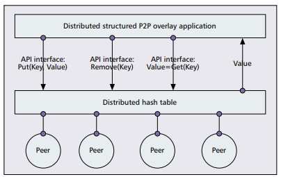
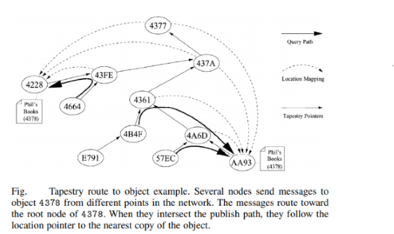

# Distributed Hash Table using TAPESTRY ALGORITHM
## Objective:
### Using Tapestry algorithm in Elixir to construct a fault-tolerant distributed hash table for sharing files in a p2p network

The projects take inspiration from the classical paper on Tapestry Algorithm->
Tapestry: A Resilient Global-Scale Overlay for Service Deployment by Ben Y. Zhao, Ling
Huang, Jeremy Stribling, Sean C. Rhea, Anthony D. Joseph and John D. Kubiatowicz
<br>
Link - https://pdos.csail.mit.edu/~strib/docs/tapestry/tapestry_jsac03.pdf

## Introduction
Peer-to-peer (P2P) overlay networks- are distributed systems in nature, without any hierarchical organization or centralized control. Peers form self-organizing overlay networks that are overlayed on the Internet Protocol (IP) networks, offering a mix of various features such as robust wide-area routing architecture, efficient search of data items, anonymity, massive scalability, and fault tolerance.

A distributed hash table (DHT) is a decentralized storage system over a P2P overlay network that provides lookup and storage schemes similar to a hash table, storing key-value pairs. Each node in a DHT is responsible for keys along with the mapped values. Any node can efficiently retrieve the value associated with a given key.



Tapestry - employs decentralized randomness to achieve both load distribution and routing locality. Tapestry’s architecture uses a variant of the Plaxton et al. distributed search technique, with additional mechanisms to provide availability, scalability, and adaptation in the presence of failures and attacks.

The lookup and routing mechanisms of Tapestry are based on matching the suffix in NodeID as described above. Routing maps are organized into routing levels, where each level contains entries that point to a set of peers closest in distance that matches the suffix for that level. Also, each peer holds a list of pointers to peers referred to as neighbors.



## Steps To Run
Open a cmd/terminal and type the following command
```
 mix run tapestry.exs numNodes numRequests
```
```
For Failure model use -> mix run tapestry.exs numNodes numRequests failure_percent
```

## Working
### Simulation on nodes created using Elixir's "ACTOR MODEL"
I have created a network of nodes, where each node is an instace of a GenServer. SHA-I HASH function is used to generate the GUIDs and then truncated it to the desired length. The reason for truncating the HASH function is that SHA-I generates a 40 digit hexadecimal number and due to this the routing table will become unnecessarily big and filled with nil values. This would happen because it wasn't possible to execute a simulation of network for more than 1 million nodes on the current system and hence, I'm using 8 digit hash values.

**NETWORK CREATION**

When creating the network with nodes having unique GUIDs, the following things are maintained as the state of our node.

1. Neighbor map -
Create a neighbour map for each node in format of 16*8 map of lists. The columns go from 0 to 15 and rows go from 0 to 7. The value 16 denotes hexadecimal encoding i.e. base of number and value 8 denotes the ID length. We need as many levels in neighbour map as the number characters of an ID representation. So, our network can have up to 16 power 8 different node ID.

    Since neighbour map creation is a very computationally intensive task, I computed the neighbour map and backpointers of most of the nodes statically like the plaxton model.
    For this I also used parallel computing using Task.async() function utilizing all cores in the system.

   For remaining nodes, I used the Network Join algorithm to add them to network dynamically.

2. Back pointers (or Need-to-know) -
Backpointers of a node stores the information of all nodes that has the current node in their routing table. It is used in the notify process so that they can be aware of presence of new node and update their routing table if applicable. I implemented backpointers as MapSet

3. Data Store map-
This map contains the IDs of objects and is used when any object is published and requested from the Distributed hash table.

4. Levels -
I are currently using an 8 digit hexadecimal value but this can be changed into a different value depending on network size.

5. Active status
To introduce failure model. It is a Boolean field

**ROUTING USING TAPESTRY ALGORITHM**

API : Route_to_Node

I have impelemted the prefix matching algorithm as explained in the research paper. I compare the GUIDs of our current node and desired destination ID. If current node matches K prefix values of desired ID, obtain the next hop by looking into the K + 1 level of neighbour map.
Then traverse the level to find the closest possible node to the destination and cast a request to that neighbour (next hop) to route to the destination.
Once the destination is reached max_hop value is stored.

If the desired ID is not present and we cannot proceed further the current hop is the surrogate (root) and has the ID values in its data store. This is surrogate routing.

**NETWORK JOIN**

When a new node is added to system the network join works as follows-
1. all nodes join using a gateway node which is already present in the network
2. route to the surrogate id copying routing table in each hop for one level
3. optimize the copied routing table by looking into the secondry neighbours and find the closest neighbour and replace it
4. route to surrogate and inititialize the new node with computed neighbour map
5. notify the back pointers of surrogate
6. notify the entries in new node neighbor map
7. The notified nodes checks their routing table and if new node fills a hole (nil value) or closer than an existing node replace entry
8. Send acknowledgement to new node so that it can update its backpointers

**Other API**
I have also created APIs (functionalities in Tapestry nodes) like-
1. PublishObject
2. UnpublishObject

## LARGEST NETWORK SIZE
The largest network size created was for 5000 nodes and each node sent 10 requests. The max hops that were calculated was 5. This takes about 10-12 minutes to execute on quad core system.

## Fault Tolerance

To simulate failure in network I am creating a percentage of nodes which will be deactivated from the system. They will deactivate without providing the replacement node for itself and will exit abruptly from the network.

Thus, to perform routing in this unstable network, I'm using surrogate routing as specified in the research paper. The Failure percent is obtained in the command line argument.

**Surrogate Routing**

If a node suddenly exits from the system without notifying, then the messages routed to it will
be handled by the node which is closest to it. Thus, any objects that this node might be having
will be handled by the closet node.

The system will also periodically update the routing table finding replacement for inactive
nodes or place nil in neighbor map otherwise.

**Stabilization**

After a periodic time, interval, we have to stabilize the network so that the optimal neighbor
routing table is maintained by each node. After the stabilization process all the nodes will have
the objects which are closest to it.
I have tested the network for 5000 nodes for 5 requests per node and 20 percent failure
percentage.

## Observation

I see that the network can handle failures and the max hops doesn’t increase much.
But if failure percent is large, we might not get closest nodes that could route faster to
destination and so this lead to hopping to more nodes than before.
The network stabilization process can observe the failure nodes in some time and update the
neighbor hop and back pointers.


